# Technical Architecture Document

# PauseBuy
### AI-Powered Impulse Purchase Blocker

**Chrome Extension | Manifest V3 | Proxy-Based Architecture**

---

| Field | Details |
|-------|---------|
| **Version** | 1.0 |
| **Date** | January 2025 |
| **Status** | MVP Development |
| **API Model** | Proxy-Based (Server-Side Keys) |

---

## Table of Contents

1. [Executive Summary](#1-executive-summary)
2. [High-Level System Architecture](#2-high-level-system-architecture)
3. [Extension Component Architecture](#3-extension-component-architecture)
4. [Purchase Detection System](#4-purchase-detection-system)
5. [Proxy API Architecture](#5-proxy-api-architecture)
6. [Data Flow & Privacy Architecture](#6-data-flow--privacy-architecture)
7. [Observability with Comet Opik](#7-observability-with-comet-opik)
8. [Technology Stack](#8-technology-stack)
9. [Security Considerations](#9-security-considerations)
10. [Deployment Architecture](#10-deployment-architecture)

---

## 1. Executive Summary

This document outlines the complete technical architecture for PauseBuy, an AI-powered browser extension designed to help users make mindful purchasing decisions. The architecture uses a **proxy-based API approach** where all LLM calls are routed through a secure backend server, ensuring API keys are never exposed to the client.

### 1.1 Architecture Goals

- **Privacy-First Design**: All user data stored locally using Chrome Storage API
- **Secure API Access**: OpenAI API key stored server-side, never exposed to clients
- **Sub-2-Second Latency**: Fast AI response times for seamless UX
- **Cost Control**: Server-side rate limiting and usage tracking
- **Observability**: Comprehensive tracing and evaluation via Comet Opik integration

### 1.2 Why Proxy-Based Architecture

| Benefit | Description |
|---------|-------------|
| **Zero User Setup** | Users install and go - no API key configuration required |
| **Key Security** | API key stored in server environment variables, never in browser |
| **Rate Limiting** | Control usage per user, prevent abuse, manage costs centrally |
| **Monetization Ready** | Easy to implement free tier limits and premium upgrades |
| **Full Observability** | All LLM calls traced server-side with complete context |

---

## 2. High-Level System Architecture

### 2.1 System Overview Diagram

```mermaid
flowchart TB
    subgraph Browser["🌐 User's Browser (Chrome)"]
        subgraph Extension["PauseBuy Extension"]
            Popup["📊 Popup<br/>Quick Stats | Toggle | Cool-off List"]
            Dashboard["⚙️ Dashboard<br/>Analytics | Goals | Settings"]
            ContentScript["🔍 Content Script<br/>DOM Analysis | Detection | Overlay"]
            ServiceWorker["⚡ Service Worker<br/>Message Routing | Alarms | API Calls"]
            
            Popup --> ServiceWorker
            Dashboard --> ServiceWorker
            ContentScript --> ServiceWorker
        end
        
        ChromeStorage[("💾 Chrome Storage<br/>(Local Data Only)")]
        ServiceWorker <--> ChromeStorage
    end
    
    subgraph Cloud["☁️ External Services"]
        subgraph Proxy["Proxy Backend (Vercel Edge)"]
            RateLimiter["🚦 Rate Limiter<br/>100 req/day/user"]
            Validator["✅ Request Validator<br/>Zod Schema"]
            KeyVault["🔐 Secure Key Vault<br/>Environment Variables"]
            
            RateLimiter --> Validator
            Validator --> KeyVault
        end
        
        OpenAI["🤖 OpenAI API<br/>GPT-4o-mini<br/>Key Never Exposed"]
        Opik["📈 Comet Opik<br/>LLM Tracing | Evaluations"]
        
        KeyVault --> OpenAI
        KeyVault --> Opik
    end
    
    ServiceWorker -->|"HTTPS<br/>(Anonymized Data)"| RateLimiter
    OpenAI -->|Response| KeyVault
    KeyVault -->|Questions| ServiceWorker

    style Browser fill:#e0f2fe,stroke:#0284c7
    style Extension fill:#dbeafe,stroke:#3b82f6
    style Proxy fill:#1e293b,stroke:#475569,color:#fff
    style ChromeStorage fill:#dcfce7,stroke:#22c55e
    style OpenAI fill:#dbeafe,stroke:#3b82f6
    style Opik fill:#dcfce7,stroke:#22c55e
```



### 2.2 Key Architectural Decisions

1. **All LLM calls route through the Vercel Edge proxy backend**
2. **Chrome Storage API stores all user data locally on device**
3. **Only anonymized context sent to proxy** (no PII, no URLs, no goal amounts)
4. **Comet Opik receives traces from server** for full observability

---

## 3. Extension Component Architecture

### 3.1 Manifest V3 Components

| Component | File | Responsibilities |
|-----------|------|------------------|
| **Service Worker** | `background.ts` | Proxy API calls, alarm scheduling, message routing, notification triggers |
| **Content Script** | `content.ts` | DOM analysis, purchase detection, overlay injection, product data extraction |
| **Popup** | `popup.tsx` | Quick stats display, toggle controls, cooling-off list preview |
| **Options Page** | `dashboard.tsx` | Full analytics dashboard, goal management, settings configuration |

### 3.2 Message Passing Architecture


### 3.3 Component Communication Flow


### 3.4 Directory Structure

```
pausebuy/
├── manifest.json              # Extension manifest (MV3)
├── package.json               # Dependencies and scripts
│
├── src/
│   ├── background/
│   │   ├── index.ts           # Service worker entry point
│   │   ├── api/
│   │   │   ├── proxy.ts       # Proxy API client (calls backend)
│   │   │   └── opik.ts        # Opik client (optional client-side)
│   │   └── handlers/
│   │       ├── purchase.ts    # Purchase event handler
│   │       └── storage.ts     # Storage operations
│   │
│   ├── content/
│   │   ├── detectors/         # Site-specific purchase detection
│   │   ├── extractors/        # Product info extraction
│   │   └── overlay/           # React overlay component
│   │
│   ├── popup/                 # Extension popup UI
│   ├── dashboard/             # Full dashboard/options page
│   └── shared/                # Shared types, constants, utils
│
├── backend/                   # PROXY BACKEND (Vercel)
│   ├── api/
│   │   └── generate.ts        # Edge function for OpenAI API
│   ├── lib/
│   │   ├── openai.ts          # OpenAI API client
│   │   ├── opik.ts            # Opik tracing
│   │   ├── rateLimit.ts       # Rate limiting logic
│   │   └── validate.ts        # Request validation
│   └── vercel.json            # Vercel configuration
│
└── tests/                     # Unit and E2E tests
```

---

## 4. Purchase Detection System

The purchase detection system accurately identifies purchase intent across diverse e-commerce platforms using a multi-stage confidence scoring pipeline.

### 4.1 Detection Pipeline

```mermaid
flowchart LR
    subgraph Stage1["Stage 1"]
        PageLoad["📄 Page Load"]
    end
    
    subgraph Stage2["Stage 2: URL Analysis"]
        URL["🔗 URL Patterns"]
        URLDetails["/checkout<br/>/cart<br/>/payment<br/><b>0-30 pts</b>"]
    end
    
    subgraph Stage3["Stage 3: Button Detection"]
        Button["🔘 Button Text"]
        ButtonDetails["Buy Now<br/>Checkout<br/>Place Order<br/><b>0-40 pts</b>"]
    end
    
    subgraph Stage4["Stage 4: DOM Analysis"]
        DOM["🏗️ DOM Elements"]
        DOMDetails["Cart totals<br/>Payment forms<br/>Item lists<br/><b>0-30 pts</b>"]
    end
    
    PageLoad --> URL
    URL --> Button
    Button --> DOM
    
    URL ~~~ URLDetails
    Button ~~~ ButtonDetails
    DOM ~~~ DOMDetails
    
    subgraph Scoring["Confidence Scoring"]
        Score["🎯 Sum all points"]
        Threshold{"≥ 60?"}
        Trigger["✅ TRIGGER<br/>Show Overlay"]
        Pass["⏭️ NO ACTION<br/>Continue"]
    end
    
    DOM --> Score
    Score --> Threshold
    Threshold -->|Yes| Trigger
    Threshold -->|No| Pass
    
    style Trigger fill:#dcfce7,stroke:#22c55e
    style Pass fill:#f1f5f9,stroke:#94a3b8
```



### 4.2 Detection State Machine

```mermaid
stateDiagram-v2
    [*] --> IDLE
    
    IDLE --> ANALYZING: Page load / URL change
    
    ANALYZING --> NO_MATCH: Confidence < 30
    ANALYZING --> LOW_CONFIDENCE: Confidence 30-59
    ANALYZING --> HIGH_CONFIDENCE: Confidence ≥ 60
    
    NO_MATCH --> IDLE: Continue browsing
    
    LOW_CONFIDENCE --> MONITORING: Watch for buy clicks
    MONITORING --> ANALYZING: Button click detected
    
    HIGH_CONFIDENCE --> EXTRACTING: Extract product info
    EXTRACTING --> TRIGGERED: Send to Service Worker
    
    TRIGGERED --> OVERLAY_DISPLAYED: Show questions
    
    OVERLAY_DISPLAYED --> IDLE: User dismisses
    OVERLAY_DISPLAYED --> SAVED: User saves for later
    OVERLAY_DISPLAYED --> PURCHASED: User proceeds
    
    SAVED --> IDLE
    PURCHASED --> IDLE
```



### 4.3 Supported E-Commerce Sites

| Site | Detection Method | Key Selectors |
|------|------------------|---------------|
| **Amazon** | Site-specific selectors + URL patterns | `#buy-now-button`, `#add-to-cart-button` |
| **Shopify Stores** | Meta tag detection + common patterns | `[data-buy-now]`, `.shopify-payment-button` |
| **eBay, Walmart, Target** | Site-specific configurations | Custom selectors per site |
| **Other Sites** | Generic heuristics (URL + button text + DOM) | Button text matching, form detection |

### 4.4 Site Configuration Example

```typescript
// src/shared/constants/sites.ts

export interface SiteConfig {
  name: string;
  domains: string[];
  urlPatterns: {
    checkout: RegExp[];
    cart: RegExp[];
  };
  buttonSelectors: {
    buy: string[];
    checkout: string[];
    addToCart: string[];
  };
  productExtraction: {
    name: string[];
    price: string[];
    image: string[];
    category: string[];
  };
}

export const SITE_CONFIGS: Record<string, SiteConfig> = {
  amazon: {
    name: 'Amazon',
    domains: ['amazon.com', 'amazon.co.uk', 'amazon.ca'],
    urlPatterns: {
      checkout: [/\/checkout/, /\/buy\/spc/, /\/gp\/buy/],
      cart: [/\/cart/, /\/gp\/cart/]
    },
    buttonSelectors: {
      buy: ['#buy-now-button', '#buyNow', '[name="submit.buy-now"]'],
      checkout: ['#sc-buy-box-ptc-button', '[name="proceedToRetailCheckout"]'],
      addToCart: ['#add-to-cart-button', '#addToCart']
    },
    productExtraction: {
      name: ['#productTitle', '#title'],
      price: ['.a-price .a-offscreen', '#priceblock_ourprice'],
      image: ['#landingImage', '#imgBlkFront'],
      category: ['#wayfinding-breadcrumbs_feature_div a']
    }
  }
};
```

---

## 5. Proxy API Architecture

All LLM calls are routed through a secure proxy backend hosted on Vercel Edge Functions. This ensures the OpenAI API key is never exposed to clients.

### 5.1 Proxy Request Flow

```mermaid
flowchart TB
    subgraph Client["🌐 Browser (Client)"]
        CS["Content Script<br/>Product detected"]
        SW["Service Worker<br/>Build request"]
        
        CS --> SW
        
        Sent["📤 <b>Sent to Proxy:</b><br/>• Product name<br/>• Price<br/>• Category<br/>• Time of day<br/>• Goal name (no amount)<br/>• Friction level"]
    end
    
    subgraph Server["🖥️ Proxy Backend (Vercel Edge)"]
        RL["🚦 Rate Limiter<br/>100 req/day"]
        Val["✅ Validator<br/>Zod Schema"]
        API["🔐 Secure API Call<br/>Key in env vars"]
        
        RL --> Val
        Val --> API
    end
    
    subgraph External["☁️ External APIs"]
        OpenAI["🤖 GPT-4o-mini"]
        Opik["📈 Comet Opik"]
    end
    
    SW -->|"HTTPS POST"| RL
    API --> OpenAI
    API --> Opik
    OpenAI -->|Response| API
    API -->|Questions| SW

    style Client fill:#e0f2fe,stroke:#0284c7
    style Server fill:#1e293b,stroke:#475569,color:#fff
    style External fill:#f1f5f9,stroke:#94a3b8
```



### 5.2 Backend Implementation

```typescript
// backend/api/generate.ts - Vercel Edge Function

import OpenAI from 'openai';
import { Opik } from 'opik';
import { rateLimit } from '../lib/rateLimit';
import { validateRequest, ReflectionRequest } from '../lib/validate';

// API key stored securely in Vercel environment variables
const openai = new OpenAI({
  apiKey: process.env.OPENAI_API_KEY  // Never exposed to client
});

const opik = new Opik({
  apiKey: process.env.OPIK_API_KEY,
  projectName: 'pausebuy-production'
});

export const config = { runtime: 'edge' };

export default async function handler(req: Request) {
  // 1. Rate limiting (100 requests/day per user)
  const clientId = req.headers.get('x-client-id') || 'anonymous';
  const rateLimitResult = await rateLimit(clientId, 100);
  
  if (!rateLimitResult.allowed) {
    return new Response(JSON.stringify({
      error: 'Rate limit exceeded',
      resetAt: rateLimitResult.resetAt
    }), { status: 429 });
  }
  
  // 2. Validate request schema
  const body = await req.json();
  const validation = validateRequest(body);
  
  if (!validation.valid) {
    return new Response(JSON.stringify({
      error: 'Invalid request',
      details: validation.errors
    }), { status: 400 });
  }
  
  const request = validation.data as ReflectionRequest;
  
  // 3. Start Opik trace
  const trace = opik.trace({
    name: 'reflection_generation',
    metadata: {
      clientId,
      product: request.product.name,
      category: request.product.category,
      price: request.product.price
    }
  });
  
  try {
    // 4. Call OpenAI API
    const startTime = Date.now();
    
    const response = await openai.chat.completions.create({
      model: 'gpt-4o-mini',
      max_tokens: 300,
      temperature: 0.7,
      messages: [{
        role: 'user',
        content: buildPrompt(request)
      }]
    });
    
    const latency = Date.now() - startTime;
    
    // 5. Log to Opik
    opik.logLLMCall({
      traceId: trace.id,
      model: 'gpt-4o-mini',
      messages: [{ role: 'user', content: buildPrompt(request) }],
      completion: response.content[0].text,
      usage: {
        inputTokens: response.usage.input_tokens,
        outputTokens: response.usage.output_tokens
      },
      latencyMs: latency
    });
    
    // 6. Parse and return response
    const result = parseResponse(response.content[0].text);
    
    trace.end({ metadata: { success: true, latency } });
    
    return new Response(JSON.stringify(result), {
      status: 200,
      headers: {
        'Content-Type': 'application/json',
        'X-RateLimit-Remaining': rateLimitResult.remaining.toString()
      }
    });
    
  } catch (error) {
    trace.end({ metadata: { success: false, error: error.message } });
    
    return new Response(JSON.stringify({
      error: 'AI service error',
      fallback: getFallbackQuestions()
    }), { status: 500 });
  }
}
```

### 5.3 Rate Limiting Implementation

```typescript
// backend/lib/rateLimit.ts

import { kv } from '@vercel/kv';

interface RateLimitResult {
  allowed: boolean;
  remaining: number;
  resetAt: number;
}

export async function rateLimit(
  clientId: string, 
  limit: number = 100
): Promise<RateLimitResult> {
  const key = `ratelimit:${clientId}`;
  const now = Date.now();
  const windowMs = 24 * 60 * 60 * 1000; // 24 hours
  const windowStart = now - windowMs;
  
  // Get current count
  const data = await kv.get<{ count: number; windowStart: number }>(key);
  
  if (!data || data.windowStart < windowStart) {
    // New window
    await kv.set(key, { count: 1, windowStart: now }, { ex: 86400 });
    return { allowed: true, remaining: limit - 1, resetAt: now + windowMs };
  }
  
  if (data.count >= limit) {
    return { 
      allowed: false, 
      remaining: 0, 
      resetAt: data.windowStart + windowMs 
    };
  }
  
  // Increment count
  await kv.set(key, { 
    count: data.count + 1, 
    windowStart: data.windowStart 
  }, { ex: 86400 });
  
  return { 
    allowed: true, 
    remaining: limit - data.count - 1, 
    resetAt: data.windowStart + windowMs 
  };
}
```

### 5.4 Client-Side Proxy Call

```typescript
// src/background/api/proxy.ts

const PROXY_URL = 'https://pausebuy-api.vercel.app/api/generate';

interface ProxyRequest {
  product: {
    name: string;
    price: number;
    category: string;
  };
  context: {
    timeOfDay: string;
    goalName: string | null;  // Name only, no amounts
    recentPurchaseCount: number;
    frictionLevel: number;
  };
}

export async function callProxyAPI(
  request: ProxyRequest
): Promise<ReflectionResponse> {
  // Get or generate client ID for rate limiting
  const { clientId } = await chrome.storage.local.get('clientId');
  const id = clientId || crypto.randomUUID();
  
  if (!clientId) {
    await chrome.storage.local.set({ clientId: id });
  }
  
  const response = await fetch(PROXY_URL, {
    method: 'POST',
    headers: {
      'Content-Type': 'application/json',
      'X-Client-Id': id
    },
    body: JSON.stringify(request)
  });
  
  if (response.status === 429) {
    const error = await response.json();
    throw new RateLimitError(error.resetAt);
  }
  
  if (!response.ok) {
    const error = await response.json();
    if (error.fallback) {
      return { 
        questions: error.fallback, 
        goalImpact: null, 
        riskLevel: 'medium' 
      };
    }
    throw new Error(error.error);
  }
  
  return response.json();
}
```

---

## 6. Data Flow & Privacy Architecture

### 6.1 Privacy-First Data Architecture

```mermaid
flowchart LR
    subgraph Local["🔒 LOCAL STORAGE (Device Only)"]
        direction TB
        L1["✓ Full purchase history"]
        L2["✓ Financial goals & amounts"]
        L3["✓ Product names and prices"]
        L4["✓ Cooling-off list"]
        L5["✓ User settings"]
        L6["✓ Analytics & statistics"]
        
        Privacy["🛡️ <b>Privacy Guarantee:</b><br/>This data NEVER<br/>leaves your device"]
    end
    
    subgraph Sent["📤 SENT TO PROXY (Anonymized)"]
        direction TB
        S1["→ Product name (current only)"]
        S2["→ Price"]
        S3["→ Category"]
        S4["→ Time of day"]
        S5["→ Goal name (no amount)"]
        S6["→ Friction preference"]
    end
    
    subgraph Never["🚫 NEVER SENT"]
        direction TB
        N1["✗ Browsing history"]
        N2["✗ Personal identifiers"]
        N3["✗ Goal amounts"]
        N4["✗ URLs visited"]
        N5["✗ Purchase history"]
    end
    
    style Local fill:#dcfce7,stroke:#22c55e
    style Sent fill:#ffedd5,stroke:#f97316
    style Never fill:#fef2f2,stroke:#ef4444
```



### 6.2 Data Classification

| Data Type | Storage Location | Justification |
|-----------|------------------|---------------|
| Purchase History | **Local Only** | Sensitive financial behavior - never leaves device |
| Financial Goals | **Local Only** | Personal financial targets with amounts - local only |
| Product Name/Price | Sent to Proxy | Required for contextual questions - anonymized, not stored |
| Time of Day | Sent to Proxy | Enables time-aware prompts (late night awareness) |
| Goal Name (no amount) | Sent to Proxy | Allows goal reference in questions without exposing amounts |
| URLs Visited | **Never Sent** | Browsing history is private - never transmitted |

### 6.3 Complete Data Flow

```mermaid
flowchart TB
    subgraph Website["🛒 E-Commerce Website"]
        AddCart["Add to Cart"] --> Cart["Cart Page"]
        Cart --> Checkout["Checkout"]
        Checkout --> Payment["Payment"]
    end
    
    subgraph Detection["🔍 Content Script"]
        Detect["Detect Intent"]
        Extract["Extract Product"]
        Validate["Validate Data"]
    end
    
    Website --> Detect
    Detect --> Extract
    Extract --> Validate
    
    subgraph Worker["⚡ Service Worker"]
        Handler["Purchase Handler"]
        Context["Load User Context"]
        Build["Build Request"]
        
        Handler --> Context
        Context --> Build
    end
    
    Validate --> Handler
    
    subgraph Storage["💾 Chrome Storage"]
        Profile["User Profile"]
        Goals["Goals"]
        History["History"]
        Settings["Settings"]
    end
    
    Context <-->|"Read"| Storage
    
    subgraph Proxy["🖥️ Proxy Backend"]
        Rate["Rate Limit"]
        Valid["Validate"]
        Call["API Call"]
        Log["Log to Opik"]
    end
    
    Build -->|"HTTPS POST"| Rate
    Rate --> Valid
    Valid --> Call
    Call --> Log
    
    subgraph OpenAIAPI["🤖 OpenAI API"]
        Generate["Generate Questions"]
    end
    
    Call --> Generate
    Generate --> Call
    
    subgraph Response["📋 Response"]
        Questions["Questions"]
        Impact["Goal Impact"]
        Risk["Risk Level"]
    end
    
    Call --> Response
    Response --> Handler
    
    subgraph Overlay["🎯 Overlay Component"]
        Display["Display Questions"]
        Capture["Capture Response"]
        Action["User Action"]
    end
    
    Handler --> Display
    Display --> Capture
    Capture --> Action
    
    subgraph Outcome["📊 Outcome"]
        Bought["Bought"]
        Saved["Saved for Later"]
        CooledOff["Cooled Off"]
    end
    
    Action --> Outcome
    Outcome -->|"Update Stats"| Storage
```



---

## 7. Observability with Comet Opik

### 7.1 Server-Side Tracing

With proxy-based architecture, all Opik tracing happens server-side, providing complete visibility into LLM performance and costs.

```mermaid
flowchart TB
    subgraph Trace["📊 TRACE: purchase_intervention"]
        direction TB
        TraceInfo["trace_id: uuid<br/>start_time: timestamp"]
        
        subgraph Span1["SPAN: purchase_detection"]
            S1Info["duration: 50ms<br/>attributes: site, confidence"]
        end
        
        subgraph Span2["SPAN: product_extraction"]
            S2Info["duration: 30ms<br/>attributes: name, price, category"]
        end
        
        subgraph Span3["SPAN: context_gathering"]
            S3Info["duration: 20ms<br/>attributes: goals, recent_purchases"]
        end
        
        subgraph Span4["SPAN: llm_call ⭐"]
            S4Info["model: gpt-4o-mini<br/>input_tokens: 450<br/>output_tokens: 120<br/>duration: 800ms"]
        end
        
        subgraph Span5["SPAN: user_interaction"]
            S5Info["duration: 15000ms<br/>outcome: saved | bought | cooled_off"]
        end
        
        TraceInfo --> Span1
        Span1 --> Span2
        Span2 --> Span3
        Span3 --> Span4
        Span4 --> Span5
        
        EndInfo["end_time: timestamp<br/>total_duration: 15900ms"]
        Span5 --> EndInfo
    end
    
    style Trace fill:#f3e8ff,stroke:#a855f7
    style Span4 fill:#ffedd5,stroke:#f97316
```



### 7.2 Opik Tracer Implementation

```typescript
// backend/lib/opik.ts

import { Opik } from 'opik';

const opik = new Opik({
  apiKey: process.env.OPIK_API_KEY,
  projectName: 'pausebuy-production'
});

export async function traceIntervention(
  clientId: string,
  product: ProductInfo,
  handler: () => Promise<InterventionResult>
): Promise<InterventionResult> {
  
  const trace = opik.trace({
    name: 'purchase_intervention',
    metadata: {
      clientId,
      productName: product.name,
      productPrice: product.price,
      productCategory: product.category,
      timestamp: new Date().toISOString()
    }
  });
  
  try {
    // Span: Context Gathering
    const context = await trace.span('context_gathering', async () => {
      return gatherContext(product);
    });
    
    // Span: LLM Call
    const llmResult = await trace.span('llm_call', async (span) => {
      const startTime = Date.now();
      
      const response = await openai.chat.completions.create({
        model: 'gpt-4o-mini',
        max_tokens: 300,
        messages: [{ role: 'user', content: buildPrompt(context) }]
      });
      
      // Log LLM-specific data
      span.logLLMCall({
        model: 'gpt-4o-mini',
        inputTokens: response.usage.input_tokens,
        outputTokens: response.usage.output_tokens,
        latencyMs: Date.now() - startTime
      });
      
      return parseResponse(response);
    });
    
    trace.end({ metadata: { success: true } });
    return llmResult;
    
  } catch (error) {
    trace.end({ 
      metadata: { 
        success: false, 
        error: error.message 
      } 
    });
    throw error;
  }
}
```

### 7.3 Evaluation Metrics

| Metric | Measurement | Target | Implementation |
|--------|-------------|--------|----------------|
| **Question Relevance** | LLM-as-judge scoring (1-5) | Average > 4.0 | Async eval with GPT-4o |
| **Prevention Rate** | % purchases prevented | > 30% | Client reports outcome to proxy |
| **User Engagement** | % prompts answered vs dismissed | > 60% | Track overlay interactions |
| **Latency P95** | End-to-end response time | < 2 seconds | Measured in proxy function |
| **Cost per Request** | API cost per intervention | < $0.002 | Token counts tracked per trace |

### 7.4 A/B Testing Framework


---

## 8. Technology Stack

### 8.1 Client-Side (Browser Extension)

| Technology | Version | Purpose |
|------------|---------|---------|
| **Plasmo** | 0.84+ | Extension framework - React-based, Manifest V3 native |
| **TypeScript** | 5.3+ | Type safety and better tooling |
| **React** | 18.2+ | UI framework for popup, dashboard, overlay |
| **Tailwind CSS** | 3.4+ | Utility-first styling |
| **Zustand** | 4.4+ | Lightweight state management with Chrome Storage sync |
| **Zod** | 3.22+ | Runtime validation for messages and storage |
| **Recharts** | 2.10+ | Charts for analytics dashboard |

### 8.2 Server-Side (Proxy Backend)

| Technology | Version | Purpose |
|------------|---------|---------|
| **Vercel Edge Functions** | Latest | Serverless API with global edge deployment |
| **Vercel KV** | Latest | Redis-compatible store for rate limiting |
| **openai** | 4.77+ | Official OpenAI API client |
| **Comet Opik** | Latest | LLM observability and evaluation |
| **Zod** | 3.22+ | Request validation and schema enforcement |

### 8.3 Development & Testing

| Technology | Version | Purpose |
|------------|---------|---------|
| **Vite** | 5.0+ | Fast builds with HMR |
| **Vitest** | 1.0+ | Unit testing |
| **Playwright** | 1.40+ | E2E testing |
| **ESLint + Prettier** | Latest | Code quality |

---

## 9. Security Considerations

### 9.1 Threat Model Comparison

```mermaid
flowchart LR
    subgraph Proxy["✅ Proxy Architecture"]
        P1["API Key Exposure: ELIMINATED"]
        P2["Cost Abuse: LOW"]
        P3["Data Exfiltration: LOW"]
    end
    
    subgraph UserKey["❌ User-Provided Key"]
        U1["API Key Exposure: HIGH"]
        U2["Cost Abuse: HIGH"]
        U3["Data Exfiltration: MEDIUM"]
    end
    
    style Proxy fill:#dcfce7,stroke:#22c55e
    style UserKey fill:#fef2f2,stroke:#ef4444
```



| Threat | Risk (Proxy) | Risk (User Key) | Mitigation |
|--------|--------------|-----------------|------------|
| **API Key Exposure** | ELIMINATED | HIGH | Key stored in server env vars only |
| **Cost Abuse** | LOW | HIGH | Server-side rate limiting per client |
| **Data Exfiltration** | LOW | LOW | Only anonymized context sent; validated |
| **Request Tampering** | LOW | MEDIUM | Schema validation on all requests |
| **DDoS on Proxy** | MEDIUM | N/A | Vercel's built-in DDoS protection |

### 9.2 Security Best Practices

1. **API key stored exclusively in Vercel environment variables**
2. **All requests validated with Zod schemas before processing**
3. **Rate limiting prevents abuse and controls costs**
4. **HTTPS enforced for all proxy communications**
5. **Client IDs are anonymous UUIDs with no PII**
6. **No sensitive data (goal amounts, URLs) transmitted to proxy**
7. **Content Security Policy enforced in extension**

### 9.3 Request Validation Schema

```typescript
// backend/lib/validate.ts

import { z } from 'zod';

const ProductSchema = z.object({
  name: z.string().max(200),
  price: z.number().positive().max(100000),
  category: z.string().max(50)
});

const ContextSchema = z.object({
  timeOfDay: z.enum(['morning', 'afternoon', 'evening', 'night', 'late_night']),
  goalName: z.string().max(100).nullable(),
  recentPurchaseCount: z.number().int().min(0).max(100),
  frictionLevel: z.number().int().min(1).max(5)
});

export const ReflectionRequestSchema = z.object({
  product: ProductSchema,
  context: ContextSchema
});

export function validateRequest(body: unknown) {
  const result = ReflectionRequestSchema.safeParse(body);
  
  if (!result.success) {
    return {
      valid: false,
      errors: result.error.flatten()
    };
  }
  
  return {
    valid: true,
    data: result.data
  };
}
```

---

## 10. Deployment Architecture

### 10.1 Infrastructure Overview


### 10.2 Deployment Targets

| Component | Platform | Configuration |
|-----------|----------|---------------|
| **Browser Extension** | Chrome Web Store | Standard extension publish process |
| **Proxy Backend** | Vercel (Edge Functions) | Auto-deploy from GitHub, global edge network |
| **Rate Limit Store** | Vercel KV | Managed Redis, auto-scales with usage |

### 10.3 Environment Variables (Backend)

```bash
# Vercel Environment Variables (set in dashboard, never in code)

OPENAI_API_KEY=sk-...            # OpenAI API key
OPIK_API_KEY=...                 # Comet Opik API key  
KV_REST_API_URL=...              # Vercel KV URL (auto-set)
KV_REST_API_TOKEN=...            # Vercel KV token (auto-set)

# Optional
RATE_LIMIT_PER_DAY=100           # Requests per user per day
ALLOWED_ORIGINS=chrome-extension://*  # CORS origins
```

### 10.4 Cost Estimation

| Service | Free Tier | Est. Cost at 10K Users |
|---------|-----------|------------------------|
| **Vercel Edge Functions** | 100K invocations/month | ~$20/month |
| **Vercel KV** | 256MB storage | ~$5/month |
| **OpenAI API (GPT-4o-mini)** | N/A | ~$100/month (5 req/user/day) |
| **Comet Opik** | Free tier available | ~$0 (free tier sufficient) |

**Total estimated cost at 10K users: ~$175/month**

---

## Appendix A: Message API Reference

```typescript
// src/shared/types/messages.ts

// Content Script → Service Worker
interface PurchaseDetectedMessage {
  type: 'PURCHASE_DETECTED';
  product: {
    name: string;
    price: number;
    category: string;
    url: string;
    image?: string;
  };
  site: string;
  detectionConfidence: number;
}

interface SaveForLaterMessage {
  type: 'SAVE_FOR_LATER';
  product: {
    name: string;
    price: number;
    url: string;
    image?: string;
  };
}

interface PurchaseOutcomeMessage {
  type: 'PURCHASE_OUTCOME';
  eventId: string;
  outcome: 'bought' | 'saved' | 'cooled_off';
  reflectionTime: number;
  questionsAnswered: string[];
}

// Popup → Service Worker
interface GetStatsMessage {
  type: 'GET_STATS';
  period: 'day' | 'week' | 'month' | 'all';
}

// Service Worker → Content Script
interface ReflectionQuestionsResponse {
  type: 'REFLECTION_QUESTIONS';
  eventId: string;
  questions: string[];
  goalImpact: {
    goalName: string;
    delayDays: number;
    newProgress: number;
  } | null;
  riskLevel: 'low' | 'medium' | 'high';
}
```

---

## Appendix B: Error Handling

| Error Type | User Experience | Technical Response |
|------------|-----------------|-------------------|
| **API Rate Limited** | Show generic fallback questions | Return cached fallbacks; log to Opik |
| **API Timeout** | Show loading for 3s, then fallback | 5s timeout; single retry; then fallback |
| **Invalid Response** | Show fallback questions | Parse error logged; use defaults |
| **Network Error** | "Check your connection" message | Retry with exponential backoff |
| **Detection False Positive** | "Not shopping" dismiss button | Log for model improvement |

### Fallback Questions

```typescript
// src/shared/constants/fallbacks.ts

export const FALLBACK_QUESTIONS = [
  "Do you need this right now, or can it wait a few days?",
  "How will you feel about this purchase in a week?",
  "Is this aligned with your current financial goals?",
  "Would you still want this if there was no sale?",
  "Do you already own something that serves this purpose?"
];

export function getRandomFallbackQuestions(count: number = 2): string[] {
  const shuffled = [...FALLBACK_QUESTIONS].sort(() => Math.random() - 0.5);
  return shuffled.slice(0, count);
}
```

---

## Appendix C: Storage Schema

```typescript
// src/shared/types/storage.ts

interface UserProfile {
  id: string;                    // Anonymous UUID
  createdAt: string;
  settings: {
    frictionLevel: 1 | 2 | 3 | 4 | 5;
    enabledSites: string[];
    quietHours: { start: string; end: string } | null;
    notifications: boolean;
  };
}

interface FinancialGoal {
  id: string;
  name: string;
  targetAmount: number;
  currentAmount: number;
  deadline: string;
  priority: 'high' | 'medium' | 'low';
}

interface PurchaseEvent {
  id: string;
  timestamp: string;
  product: {
    name: string;
    price: number;
    category: string;
    url: string;
  };
  site: string;
  outcome: 'bought' | 'saved' | 'cooled_off';
  questionsAsked: string[];
  reflectionTime: number;
}

interface CoolingOffItem {
  id: string;
  product: {
    name: string;
    price: number;
    url: string;
    image?: string;
  };
  savedAt: string;
  expiresAt: string;
  status: 'pending' | 'purchased' | 'expired' | 'deleted';
}
```

---

*Document Version: 2.0 (Proxy-Based Architecture)*  
*Last Updated: January 2025*

---

**End of Document**
